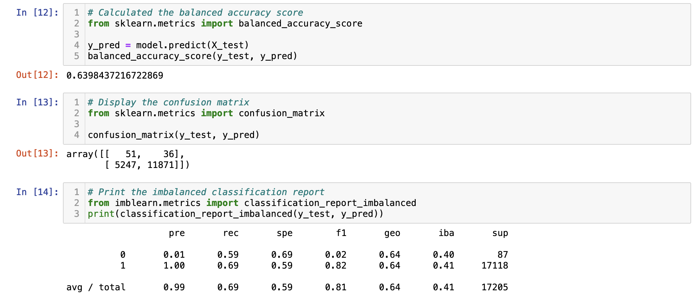
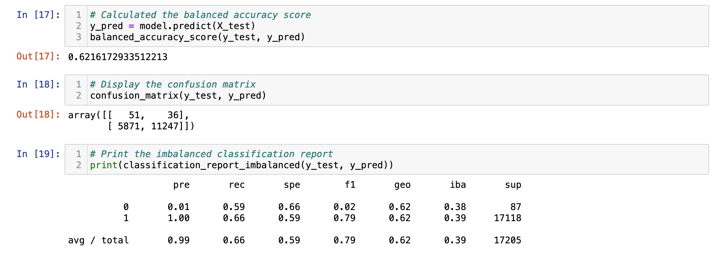
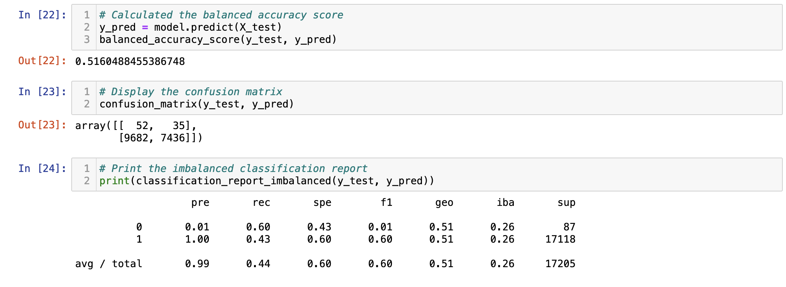
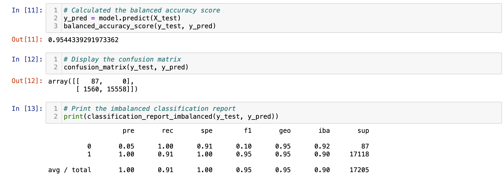
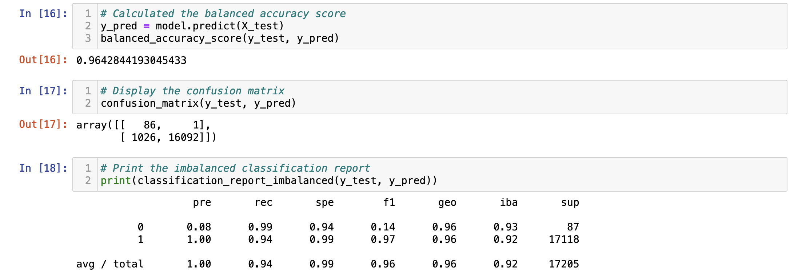

# Credit Risk Analysis

## Overview of the Analysis

The purpose of this analysis was to create supervised machine learning models to predict credit risk. Basic logistic regression models were combined with oversampling and undersampling methods as well as two other models, the balanced random forest model and easy ensemble classifier model.

## Results

- Naive Random Oversampling:

- SMOTE Oversampling:

- Undersampling:

- SMOTEENN Sampling:

- Balanced Random Forest Classifier:

- Easy Ensemble AdaBoost Classifier:

## Summary

Overall, 
